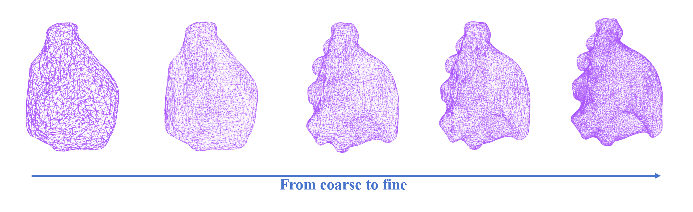

# **KidMesh**  
**Computational Mesh Reconstruction for Pediatric Congenital Hydronephrosis Using Deep Neural Networks**


---

## **Overview**

We proposed a novel end-to-end mesh reconstruction network (i.e., KidMesh), which produces computable mesh of CH areas solely based on MRU. It achieves
comparable accuracy to conventional methods, with improved topological correctness. This approach has the potential to reconstruct computational models for urodynamic simulations, aiding urologists in surgical planning.

This repository contains the slogan, templates, and demo for the **KidMesh** project. The paper is currently under submission. Once it is accepted, we will open-source the code to enhance the repository.

---


## **Table of Contents**

1. [Slogan](#Slogan)  
2. [Templates](#Templates)  
3. [Demo](#Demo)  


---

## **Slogan**


---

## **Templates**

We provide some kidney-shaped templates with different numbers of vertices which satisfy user's various requirements.
1. **Format**: Initial templates are in Wavefront OBJ (.obj) format.  
2. **Structure**: We Organize templates as follows:
   ```
   template/
   ├── kidney_x.obj
   ```

3. **Notice**: The 'x' in the filename represents the number of vertices included in the template. 

---

## **Demo**

### 1. INPUT (MRU)


### 2. DEFORM 


### 3. OUTPUT (MESH)

---


